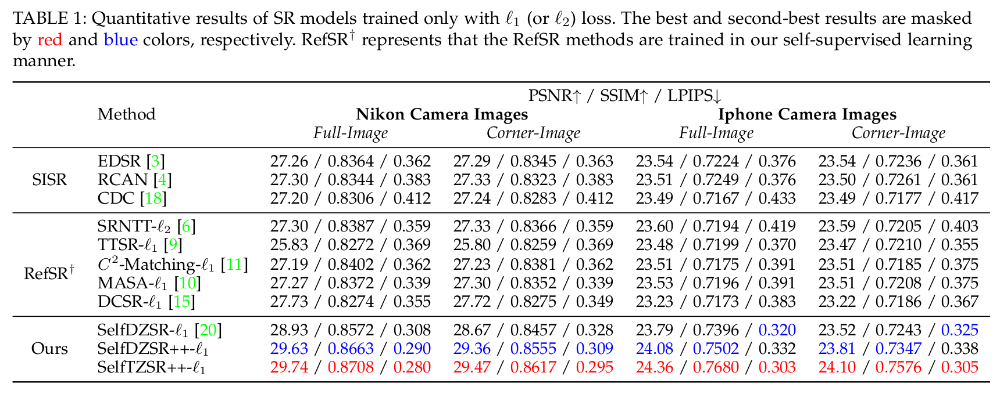
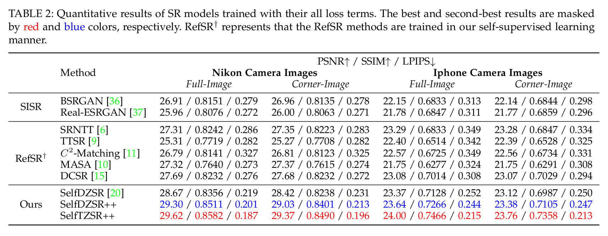

# SelfDZSR++ (TPAMI 2024)

Official PyTorch implementation of [**SelfDZSR++ and SelfTZSR++**](https://arxiv.org/abs/2405.02171)

This work is extended from [SelfDZSR](https://arxiv.org/abs/2203.01325) (ECCV 2022, [GitHub](https://github.com/cszhilu1998/SelfDZSR)).

> [**Self-Supervised Learning for Real-World Super-Resolution from Dual and Multiple Zoomed Observations**](https://ieeexplore.ieee.org/abstract/document/10476716)  
> IEEE TPAMI, 2024  
> [Zhilu Zhang](https://scholar.google.com/citations?user=8pIq2N0AAAAJ), [Ruohao Wang](https://scholar.google.com/citations?user=o1FPNwQAAAAJ), [Hongzhi Zhang](https://scholar.google.com/citations?user=Ysk4WBwAAAAJ), [Wangmeng Zuo](https://scholar.google.com/citations?user=rUOpCEYAAAAJ)
 Harbin Institute of Technology, China

 &nbsp; | &nbsp; 

## 1. Improvements Compared to SelfDZSR

### 1.1 Improvements in Methodology

- Introduce patch-based optical flow alignment to further mitigate the effect of the misalignment between data pairs. (**Section 3.2.1: Patch-based Optical Flow Alignment**)
- Present LOSW (Local Overlapped Sliced Wasserstein) loss to generate visually pleasing results.  (**Section 3.5: LOSW Loss and Learning Objective**)
- Extend DZSR (Super-Resolution based on Dual Zoomed Observations) to multiple zoomed observations, where we present a progressive fusion scheme for better restoration.  (**Section 3.6: Extension to Multiple Zoomed Observations**)

### 1.2 Improvements in Experiments

- Evaluate the proposed method on a larger iPhone camera dataset. (**Section 4.2: Quantitative and Qualitative Results**)
- Evaluate the extended method that is based on triple zoomed images. (**Section 4.2: Quantitative and Qualitative Results**)
- Compare \#FLOPs of different methods.  (**Section 4.3: Comparison of \#Parameters and \#FLOPs**)
- More ablation experiments, including (1) effect of different loss terms (**Section 5.3: Effect of LOSW Loss**); (2) effect of different reference images and fusion schemes (**Section 5.4: Effect of Different Refs and Fusion Schemes**); (3) effect of scaling up models (**Section 5.5: Effect of Scaling up Models**).

## 2. Preparation and Datasets

### 2.1  Prerequisites 
- Python 3.x and **PyTorch 1.12**.
- OpenCV, NumPy, Pillow, tqdm, lpips, scikit-image and tensorboardX.

### 2.2  Dataset 
- **Nikon camera images** can be downloaded from this [link](https://pan.baidu.com/s/1yEPBCMjJzFsEpTWU8W4SgQ?pwd=2rbh).
- **iPhone camera images** can be downloaded from this [link](https://pan.baidu.com/s/1_AXwyn-nDhSckcH5phnEzQ?pwd=ripz).
   
    

## 3. Quick Start

### 3.1 Pre-Trained Models

- All pre-trained models are provided in this [link](https://pan.baidu.com/s/1ZvdCqZZVY36GyX67qjtl0g?pwd=bkd9). Please place `ckpt` folder under `SelfDZSR_PlusPlus` folder.

- For simplifying the training process, we provide the pre-trained models of feature extractors and auxiliary-LR generator. The models for Nikon and iPhone camera images are put in the `./ckpt/nikon_pretrain_models/` and `./ckpt/iphone_pretrain_models/` folder, respectively.

- For direct testing, we provide the 8 pre-trained DZSR and TZSR models (`dzsr_nikon_l1`, `dzsr_nikon_l1sw`, `dzsr_iphone_l1`, `dzsr_iphone_l1sw`, `tzsr_nikon_l1`, `tzsr_nikon_l1sw`, `tzsr_iphone_l1`, and `tzsr_iphone_l1sw`) in the `./ckpt/` folder. Taking `tzsr_nikon_l1sw` as an example, it represents the TZSR model trained on the Nikon camera images using $l_1$ and local overlapped sliced Wasserstein loss terms.

### 3.2 Training

- Modify `dataroot`,  `camera`, `data`, `model`, and `name`
- Run [`sh train.sh`](train.sh)

### 3.3 Testing

- Modify `dataroot`,  `camera`, `data`, `model`, and `name`
- Run [`sh test.sh`](test.sh)

### 3.4 Note

- You can specify which GPU to use by `--gpu_ids`, e.g., `--gpu_ids 0,1`, `--gpu_ids 3`, `--gpu_ids -1` (for CPU mode). In the default setting, all GPUs are used.
- You can refer to [options](./options/base_options.py) for more arguments.

## 4. Results

## 5. Citation
If you find it useful in your research, please consider citing:

    @inproceedings{SelfDZSR,
        title={Self-Supervised Learning for Real-World Super-Resolution from Dual Zoomed Observations},
        author={Zhang, Zhilu and Wang, Ruohao and Zhang, Hongzhi and Chen, Yunjin and Zuo, Wangmeng},
        booktitle={European Conference on Computer Vision (ECCV)},
        year={2022}
    }

    @article{SelfDZSR_PlusPlus,
        title={Self-Supervised Learning for Real-World Super-Resolution from Dual and Multiple Zoomed Observations},
        author={Zhang, Zhilu and Wang, Ruohao and Zhang, Hongzhi and Zuo, Wangmeng},
        journal={IEEE Transactions on Pattern Analysis and Machine Intelligence (TPAMI)},
        year={2024},
        publisher={IEEE}
    }

## 6. Acknowledgement

This repo is built upon the framework of [CycleGAN](https://github.com/junyanz/pytorch-CycleGAN-and-pix2pix), and we borrow some code from [C2-Matching](https://github.com/yumingj/C2-Matching) and [DCSR](https://github.com/Tengfei-Wang/DCSR), thanks for their excellent work!